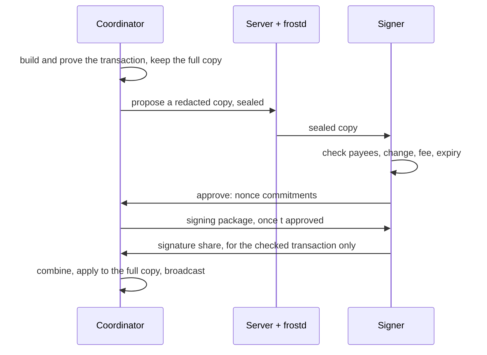

# How treasury signing works

A treasury is a shielded Zcash address controlled by a group: any `t` of its `n` signers have to agree before money leaves it. Nobody, including Zalary's server, ever holds the whole spending key. This page covers who holds what, how a payment goes from proposed to sent, and what each check protects against.

## Who's who

| | |
|---|---|
| **Coordinator** | The account owner. Proposes payments, collects approvals and broadcasts the transaction. Also a signer. |
| **Signers** | Members holding a key share. They approve payments and sign them. |
| **Zalary server** | Stores ciphertext (payroll data and every payment's details are sealed under the account key) plus who approved and signed what, and relays FROST messages through [frostd](https://github.com/ZcashFoundation/frost-tools). Holds no key and can't sign. |

## Where the keys live

| What | Who has it | Stored as |
|---|---|---|
| Key share | each signer | sealed with their passkey, in Postgres |
| Viewing key | every signer | the coordinator's copy sealed with their passkey; everyone else's encrypted to them by the coordinator |
| Account key (seals payroll data, payments, balance) | everyone with access to the account | encrypted to each person's comms key by whoever shared it with them |
| Comms key (for frostd, and as their public key) | every member | derived from their passkey; only the public half is stored |
| Signing nonces | the browser that approved | sealed in IndexedDB, used once |
| Full transaction (PCZT) | the coordinator's browser | sealed in IndexedDB |
| Redacted transaction | signers | sealed under the account key: no viewing key, no spent notes |

*Sealed with their passkey* means AES-GCM under a key that only a WebAuthn PRF assertion unlocks. Unlocking lasts until the tab reloads.

## Setting up (once)

1. The owner creates the treasury and sends one invite link per signer.
2. **Key ceremony.** Every signer's browser runs a FROST DKG over frostd. Each ends up with a share of one group key; the full key is never assembled anywhere.
3. The coordinator turns the group key into a viewing key and derives the deposit and change addresses from it. It keeps a sealed copy and encrypts one to each signer.
4. Each signer's browser opens the viewing key and checks that it belongs to the group key in their own share, and that the published addresses are the ones it derives. The treasury page then says *Checked in your browser*, or warns and hides the address.

## Paying a payroll

| Step | Who | What happens |
|---|---|---|
| 1. Propose | coordinator, by hand | Builds one transaction paying every salary, proves it in the browser, keeps the full PCZT and uploads a copy without the viewing key and the spent notes, sealed under the account key together with the payment request, the payees and the payroll runs it pays. Proposing counts as the coordinator's approval. |
| 2. Approve | each signer, by hand | The browser decodes the transaction and checks it (see below). If it passes, it makes FROST nonces, seals them together with the transaction hash it checked, and sends the commitments to the coordinator. This is FROST round 1. |
| 3. Signing package | coordinator, automatic | Once `t` signers approved, it picks the first `t` and sends them a signing package built from its own full copy. |
| 4. Sign | picked signers, automatic | Each browser signs only the transaction hash it sealed in step 2 and refuses anything else. This is FROST round 2. |
| 5. Send | coordinator, automatic | Combines the shares into one signature per spend, applies them to its full copy and broadcasts through lightwalletd. The payment counts as paid once the coordinator's wallet sees it mined. |

Steps 3 to 5 run in the background in any tab where Zalary is open and unlocked. A payment waits up to a day for approvals; after that it expires and has to be proposed again.

### What a signer checks before approving

- **Payees:** every output that isn't change pays an employee exactly what the payroll run says, at the address it was started with. Nothing else gets paid.
- **Change:** everything else goes back to the treasury. This is proven with the viewing key, not read from a label.
- **Fee:** no higher than the standard ZIP-317 fee for a transaction of that size.
- **Expiry:** the transaction expires within about a day, so it can't be held back and sent much later.
- **Integrity:** the transaction hash and spend randomizers to sign are the ones computed from the transaction itself.

## What this protects against

| If… | then… |
|---|---|
| the server swaps the transaction after people approved | signers refuse: they only sign the hash they checked, and the coordinator only works from its own copy |
| the coordinator publishes its own address as the treasury's | every signer's browser sees it doesn't derive from the group key and warns |
| a payment to someone else is disguised as change | the viewing key shows it isn't the treasury's |
| the coordinator sets a huge fee | it's over the standard fee, so signers refuse |
| the database leaks | it holds no viewing key, no spending key and no readable payroll data: who gets paid what, balances and transaction ids are all ciphertext |
| a signer loses their device | the rest can still sign, as long as `t` of them are left |

## What's still trusted

- **The code the server serves.** A compromised web server could ship JavaScript that misbehaves, and nothing in the browser can check its own code.
- **Who the other signers are.** Signers' frostd keys come from the server, so a compromised server could stand in for signers during the key ceremony. There's no out-of-band safety code yet.
- **Who gets the account key.** The owner or a delegate shares it by hand with people the server lists as being in the account. A compromised server could list a login of its own, so only share with people you invited; compare the key shown when sharing with the one in their Settings.
- **Payee addresses.** They come from the payroll data. A delegate who edits an employee's wallet address redirects that salary, and the check still passes. Approvers should read the recipients.
- **The coordinator being around.** Only the account owner can propose and broadcast. If they lose their only passkey, payments stop; a backup passkey prevents that.
- **frostd staying up.** It keeps sessions in memory, so a restart fails the payments in progress. Propose them again.

Every signer can see the treasury's balance and history: checking addresses and change needs the viewing key, and checking payees needs the account key.

## When a payment is stuck

- **"Signing" for a while:** the coordinator's browser has to be open and unlocked. The payment card shows the current step with a timer, and any error.
- **"The signing session … is gone":** frostd restarted. Propose the payment again.
- **"This payment changed after you approved it":** the server's copy no longer matches what you checked. Don't sign; cancel it and propose again.

## Code

| Where | What |
|---|---|
| [`spend.ts`](spend.ts) | propose, approve, sign, coordinate |
| [`sealed-spend.ts`](sealed-spend.ts), [`account-key.ts`](../account-key.ts) | what a payment's sealed details hold, and the account key |
| [`viewing-key.ts`](viewing-key.ts) | opening and checking the viewing key |
| [`ceremony.ts`](ceremony.ts), [`ceremony.tsx`](../../components/treasury/ceremony.tsx) | key ceremony and setup |
| [`spend-agent.tsx`](../../components/treasury/spend-agent.tsx) | the background loop for steps 3 to 5 |
| [`zcash-view-wasm`](../../../../../packages/zcash-view-wasm/src) | FROST, Noise, transaction checks and redaction (Rust) |
| [`schema/proposals`](../../../../server/src/schema/proposals) | the payment state machine on the server |
